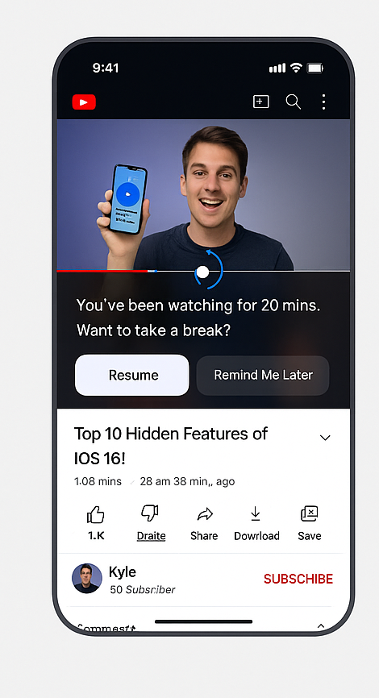
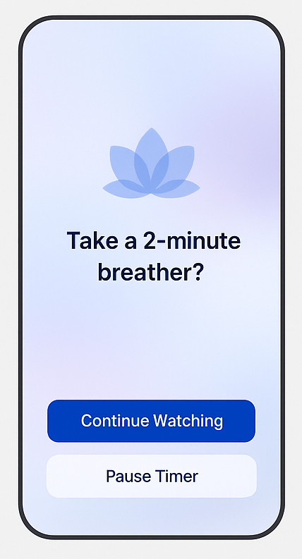
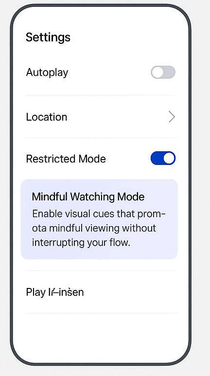

# FlowPause – Mindful Watching Without Killing Engagement

## 🔗 Figma Link
> (https://www.figma.com/design/YUODzXvLQEDL3a1AnG5bgB/design-forge-2025-mindful-watching?node-id=0-1&t=zc6tYzuU8nryRiR9-1)

## 📸 Screenshots
  
*Main video screen with soft session reminder*

  
*Break modal with resume/remind options*

  
*Settings screen with "Mindful Mode" toggle*

---

## 🎯 Concept Overview

FlowPause is a subtle redesign of YouTube’s mobile experience aimed at reducing compulsive binge-watching — without harming engagement. The idea is to use gentle UI nudges instead of forceful interruptions.

---

## ✨ Key Features

- 🧘‍♂️ **Soft Session Reminder:** After 20 mins of watch time, a light pulse appears on the screen with a mindful message.
- 🌥️ **Break Modal:** A calming overlay lets users choose to pause or continue with no judgment.
- 🛠️ **Mindful Mode Toggle:** Found in settings, this lets users enable or disable visual mindfulness cues.

---

## 🛠 Tools Used
- Figma
- GitHub

---

## 🙌 Made with love for Design Forge 2025
